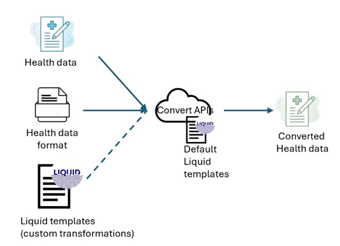

# CDCgov fork of microsoft/FHIR Converter

FHIR converter is an open source project that enables conversion of health data from eCR (electronic Case Report) to FHIR.  The FHIR converter uses the [Liquid template language](https://shopify.github.io/liquid/) and the .NET runtime.

The CDCgov fork supports only **eCR to FHIR** as of version 8. Changes to the code were needed to support this conversion in addition to improving the performance of the FHIR converter. This converter is still under active development and is not yet fully validated.

The converter uses templates that define mappings between these different data formats. The templates are written in [Liquid](https://shopify.github.io/liquid/) templating language and make use of custom [filters](docs/Filters-and-Tags.md).  

The converter comes with a few ready-to-use templates. If needed, you can create a new template, or modify existing templates to meet your specific conversion requirements. See [Templates & Authoring](#templates--authoring) for specifics.

## What's New?
The latest iteration of the *Preview* FHIR converter makes some significant changes over [previous versions](#previous-versions).

Some of the changes include:
 * Removal of input types other than eCR.
 * Removal of Azure Container repository dependency for custom templates.

 All the documentation for the new *preview* FHIR converter API can be found in the [How to Guides](docs/how-to-guides/) folder.

## Architecture

The FHIR converter API *preview* provides [REST based APIs](#api) to perform conversion requests.

The FHIR converter APIs are offered as a container artifact in [Github Container Registry](https://github.com/CDCgov/dibbs-ecr-viewer/pkgs/container/dibbs-ecr-viewer%2Ffhir-converter).

## Templates & Authoring

The FHIR converter API comes with several pre-built templates you can use as reference as to create your own.

| Conversion | Notes |
| ----- | ----- |
| [eCR to FHIR](/data/Templates/eCR/) | | 

### Concepts

In addition to the example [templates](data/Templates) provided there are several important concepts to review and consider when creating your own templates, including:
- [Filters summary](docs/Filters-and-Tags.md)
- [Snippet concept](docs/SnippetConcept.md)
- [Resource Id generation](docs/concepts/resource-id-generation.md)
- [Validation & post processing](docs/concepts/validation-and-postprocessing.md)

## API

The conversion APIs process the provided input data of the specified format and use the specified Liquid template (default or custom) and return the converted result as per the transformations in the template.

Complete details on the FHIR converter APIs and examples can be found [here](/src/Dibbs.FhirConverterApi/README.md).

## Troubleshooting

Some key concepts to consider:
* Processing time is related to both the input message size, template, and logic contained in the template.  If your template is taking a long time to execute make sure you don't have any unnecessary loops.
* The output of the template is expected to be JSON when the target is FHIR.
* When converting data to FHIR, [post processing](https://github.com/CDCgov/dibbs-FHIR-Converter/blob/main/src/Dibbs.Fhir.Liquid.Converter/OutputProcessors/PostProcessor.cs) is performed.  If you are seeing unexpected results, double check the post processing logic. 
* If you want a deeper understanding on how data is converted, look at the functional tests found [here](https://github.com/CDCgov/dibbs-FHIR-Converter/blob/main/src/Dibbs.Fhir.Liquid.Converter.FunctionalTests/ConvertDataTemplateDirectoryProviderFunctionalTests.cs)

## Previous Versions
Detailed documentation of prior Converter release is covered in the table below.

|  Version | Summary | 
| ----- |  ----- |
| [5.x Liquid](https://github.com/microsoft/FHIR-Converter/tree/e49b56f165e5607726063c681e90a28e68e39133) | Liquid engine release covers:   1. HL7v2, CCDA, and JSON to FHIR transformations.   2. Command Line utility.   3. VS Code authoring extension.   4. FHIR Service $convert integration.   5. ACR template storage. |
| [3.x Handlebars](https://github.com/microsoft/FHIR-Converter/tree/handlebars) | Previous handlebars base solution.  No longer supported. See full comparision [here](https://github.com/microsoft/FHIR-Converter/tree/e49b56f165e5607726063c681e90a28e68e39133?tab=readme-ov-file#fhir-converter).

## External resources

- [Fluid Github](https://github.com/sebastienros/fluid)
- [Liquid wiki](https://github.com/Shopify/liquid/wiki)