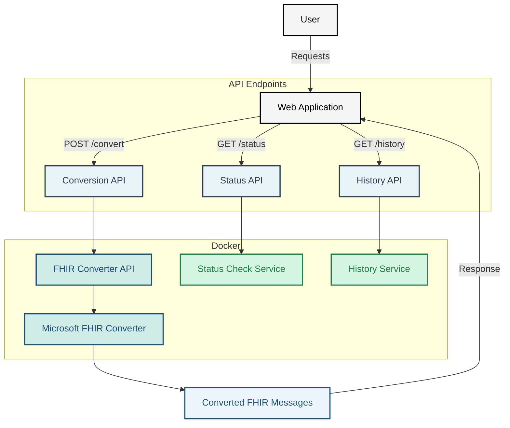

# Getting started with the DIBBs FHIR Conversion Service

### Installing the .NET SDK

To check if a .NET SDK is installed, try running `dotnet --list-sdks`. You should see an output message that lists the .NET SDK version you have installed, as well as where it's located. It should look something like the following, but note that the version number and filepath will differ depending on which operating system you use and when you installed the .NET SDK.

```
8.0.117 [C:\Program Files\dotnet\sdk]
```

If you see a message like `Command 'dotnet' not found` (MacOS and Linux) or `The term 'dotnet' is not recognized as the name of a cmdlet, function, script file, or operable program` (Windows), then .NET has not been installed. Additionally, if running `dotnet --list-sdks` does not produce any output, then you likely have the .NET runtime installed, but not the SDK. In either event, you should [follow the instructions located here to install the SDK](https://learn.microsoft.com/en-us/dotnet/core/install/).

## Running the DIBBs FHIR Conversion Service

### Running with Docker (Recommended for Production)

To run the DIBBs FHIR Conversion service with Docker, follow these steps.

1. Confirm that you have Docker installed by running `docker -v`. If you don't see a response similar to what's shown below, follow [these instructions](https://docs.docker.com/get-docker/) to install Docker.

```
❯ docker -v
Docker version 20.10.21, build baeda1f
```

2. Download a copy of the Docker image from the dibbs-ecr-viewer repository by running `docker pull ghcr.io/cdcgov/dibbs-FHIR-Converter:latest`.
3. Run the service with ` docker run -p 8080:8080 ghcr.io/cdcgov/dibbs-FHIR-Converter:latest`.

Congratulations, the FHIR Conversion service should now be running on `localhost:8080`!

### Running from C# Source Code

For local development, you may prefer to run the service directly from dotnet. To do so, simply run the command `dotnet run` from within `src/Dibbs.FhirConverterApi`

### Building the Docker Image

To build the Docker image for the FHIR Conversion service from source code instead of downloading it from the dibbs-ecr-viewer repository, follow these steps.

1. Ensure that [Docker](https://docs.docker.com/get-docker/) is installed.
2. Navigate to the root of this repo.
3. Build the image `docker build -t fhir-converter:latest .`.
4. Run the image `docker run -it fhir-converter:latest`.

#### Tips & Tricks

- To run the unit tests, use the command `dotnet test src/Dibbs.FhirConverterApi.UnitTests`.
- To run the integration tests, use the command `dotnet test src/Dibbs.FhirConverterApi.FunctionalTests`.

## Architecture Diagram



## Testing / Debugging

When testing, you can print from the liquid templates with the following command in the templates.

```
{{ "string" | print_object }}
{{ objectName | print_object }}
```

This will print objects or strings to the console for debugging purposes. You must set either of the environment variables `DEBUG_LOG` or `DEV_MODE` to `"true"`.

If debugging an exception, the below snippet of code can be helpful to get more information on where the exception is coming from.

```csharp
Console.WriteLine("Ex: {1} StackTrace: '{0}'", Environment.StackTrace, ex);
```
