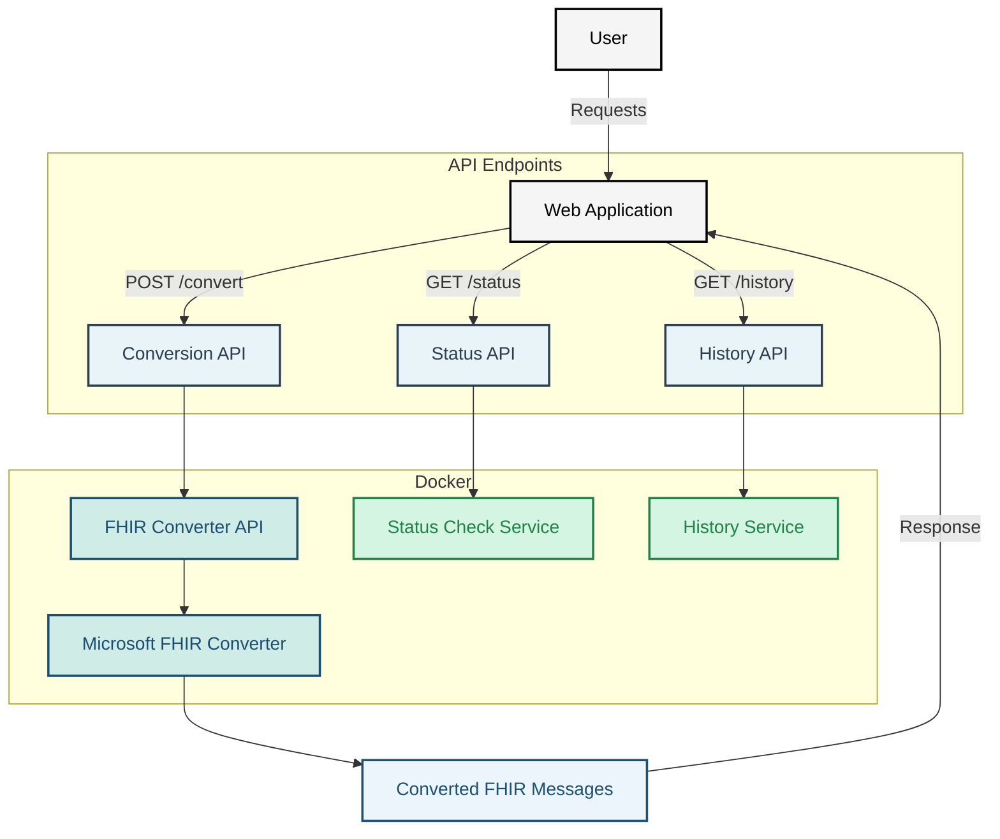

# Getting started with the DIBBs FHIR Conversion Service

### Using the .NET Framework

We will use the .NET SDK to build the FHIR Converter from source code. If you have already installed a .NET SDK, skip to [Download and Build the FHIR Converter](#download-and-build-the-fhir-converter), otherwise follow the steps below to install it on your system.

To check if a .NET SDK is installed, try running `dotnet --list-sdks`. You should see an output message that lists the .NET SDK version you have installed, as well as where it's located. It should look something like the following, but note that the version number and filepath will differ depending on which operating system you use and when you installed the .NET SDK.

```
6.0.40 [C:\Program Files\dotnet\sdk]
```

If you see a message like `Command 'dotnet' not found` (MacOS and Linux) or `The term 'dotnet' is not recognized as the name of a cmdlet, function, script file, or operable program` (Windows), then .NET has not been installed. Additionally, if running `dotnet --list-sdks` does not produce any output, then you likely have the .NET runtime installed, but not the SDK. In either event, you should follow the instructions below to install the SDK.

### Install the .NET SDK

The instructions for installing the .NET SDK will differ depending on whether you're using Windows, MacOS, or Linux. MacOS and Linux users will utilize the command line to install the software, while Windows users should use the installer. Instructions for both approaches are below.

#### MacOS and Linux

##### Download the .NET Install Script

Run `wget https://dotnet.microsoft.com/download/dotnet/scripts/v1/dotnet-install.sh` to download the .NET installation script from Microsoft.
From the directory containing the `dotnet-install.sh` file, run `sh ./dotnet-install.sh` to execute the script and install .NET. By default, this script installs the .NET SDK, which is perfect for our needs.

_Note: Bash is required to run the script. If you're using a different shell, such as zsh, it is recommend to switch to using Bash._

##### Add .NET to the PATH Environment Variable

Finally, permanently add .NET to you `PATH` variable by running `echo 'export PATH="$PATH:$HOME/.dotnet"' >> ~/.bashrc`.

##### Confirm the Installation

Restart your shell with `exec $SHELL` and then run `dotnet`. If you get a response that looks like what's shown below, then .NET was installed successfully.

```bash
Usage: dotnet [options]
Usage: dotnet [path-to-application]

Options:
  -h|--help         Display help.
  --info            Display .NET Core information.
  --list-sdks       Display the installed SDKs.
  --list-runtimes   Display the installed runtimes.

path-to-application:
  The path to an application .dll file to execute.
```

##### Installing additional versions of dotnet sdk

To install the previous versions with homebrew you can use the [dotnet-sdk-versions](https://github.com/isen-ng/homebrew-dotnet-sdk-versions) tap.

```
brew tap isen-ng/dotnet-sdk-versions
brew install --cask <version>

dotnet --list-sdks
```

#### Windows

##### Install the .NET SDK

Navigate to [https://dotnet.microsoft.com/en-us/download](https://dotnet.microsoft.com/en-us/download) and click on the "Download .NET SDK x64" button. Note that the label may read slightly differently if you're using a 32-bit operating system. Clicking this button will download a file with a name similar to `dotnet-sdk-6.0.400-win-x64.exe`, but note that the name of your file may differ if a new version of the SDK has been released. **The most important thing is to ensure that the file is for the dotnet-sdk and for Windows.**

Open this file and follow the instructions that are presented to you. If you're asked if you should allow this program to make changes to your machine, select yes. Once the installer is finished, you'll be presented with a screen that summarizes what was installed and where it was saved. The default location should be "C:\Program Files\dotnet\". Open File Explorer, navigate to the installation location (C:\Program Files\dotnet), open the "sdk" folder, and confirm that a folder exists with the .NET SDK version as its name.

##### Add .NET to the PATH Environment Variable

Open your Start Menu and type "Environment Variables" into the search bar. Select "Edit environment variables for your account" from the list of options that appear. In the top section labeled "User variables", click the variable called "Path" and then click the "Edit..." button. A new screen will pop up, and you should click the "New" button on the right-hand side. In the text box that is highlighted, enter "C:\Program Files\dotnet" (without the quotes). Hit enter, click "OK" to close the Path screen, and then click "OK" to close the Environment Variables screen.

##### Confirm the Installation

Open Powershell and run `dotnet`. If you get a response that looks like when is shown below, then .Net was installed successfully.

```bash
Usage: dotnet [options]
Usage: dotnet [path-to-application]

Options:
  -h|--help         Display help.
  --info            Display .NET Core information.
  --list-sdks       Display the installed SDKs.
  --list-runtimes   Display the installed runtimes.

path-to-application:
  The path to an application .dll file to execute.
```

## Running the DIBBs FHIR Conversion Service

### Running with Docker (Recommended for Production)

To run the DIBBs FHIR Conversion service with Docker, follow these steps.

1. Confirm that you have Docker installed by running `docker -v`. If you don't see a response similar to what's shown below, follow [these instructions](https://docs.docker.com/get-docker/) to install Docker.

```
❯ docker -v
Docker version 20.10.21, build baeda1f
```

2. Download a copy of the Docker image from the dibbs-ecr-viewer repository by running `docker pull ghcr.io/cdcgov/dibbs-FHIR-Converter:latest`.
3. Run the service with ` docker run -p 8080:8080 ghcr.io/cdcgov/dibbs-FHIR-Converter:latest`.

Congratulations, the FHIR Conversion service should now be running on `localhost:8080`!

### Running from C# Source Code

For local development, you may prefer to run the service directly from Python. To do so, follow the steps below.

1. Ensure that both Git and Dotnet 8 are installed.
2. Clone the dibbs-ecr-viewer repository with `git clone https://github.com/CDCgov/dibbs-ecr-viewer`.
3. Navigate to `/dibbs-ecr-viewer/containers/fhir-converter/`.
4. Make a fresh virtual environment with `python -m venv .venv`.
5. Activate the virtual environment with `source .venv/bin/activate` (MacOS and Linux), `venv\Scripts\activate` (Windows Command Prompt), or `.venv\Scripts\Activate.ps1` (Windows PowerShell).
6. Install all of the Python dependencies for the ingestion service with `pip install -r requirements.txt` into your virtual environment.
7. Run the FHIR Converter on `localhost:8080` with `FHIR_CONVERTER_TOOl_PATH=~/fully/qualified/path/to/Microsoft.Health.Fhir.Liquid.Converter.Tool python -m uvicorn app.main:app --host 0.0.0.0 --port 8080`.

### Building the Docker Image

To build the Docker image for the FHIR Conversion service from source code instead of downloading it from the dibbs-ecr-viewer repository, follow these steps.

1. Ensure that both [Git](https://git-scm.com/book/en/v2/Getting-Started-Installing-Git) and [Docker](https://docs.docker.com/get-docker/) are installed.
2. Clone the dibbs-ecr-viewer repository with `git clone https://github.com/CDCgov/dibbs-ecr-viewer`.
3. Navigate to `/dibbs-ecr-viewer/containers/fhir-converter/`.
4. Run the service with `make docker-local`.

#### Tips & Tricks

- To run the service tests, use the command `dotnet test`.
  - Make sure your docker image has pulled in the latest changes by building with no cache `make build-image-no-cache`.
- To run the tool tests, run the commands found in the github actions workflow.

### Updating RCTC document

RCTC spreadsheet gets updated approximately every 6 months. The latest RCTC spreadsheet can be found on the [eRDS Aims Platform](https://ersd.aimsplatform.org/#/home), an account is required to download. Two output files are created, in which `json_output_loc` holds the Grouping List, and `json_output_loc2` holds the Expansion List.
<!-- TODO: Update this -->
The script can be run by using the following command `python3 rctc-to-json.py spreadsheet_input_loc json_output_loc json_output_loc2`

## Architecture Diagram



## Testing / Debugging

When testing, you can print from the liquid templates with the following command in the templates.

```
{{ "string" | print_object }}
{{ objectName | print_object }}
```

This will print objects or strings to the console for debugging purposes. You must set the environment variables `DEV_MODE` and `DEBUG_LOG` to `"true"`.

If debugging an exception, the below snippet of code can be helpful to get more information on where the exception is coming from.

```csharp
Console.WriteLine("Ex: {1} StackTrace: '{0}'", Environment.StackTrace, ex);
```

# License (for Microsoft FHIR Converter)

MIT License

Copyright (c) Microsoft Corporation. All rights reserved.

Permission is hereby granted, free of charge, to any person obtaining a copy
of this software and associated documentation files (the "Software"), to deal
in the Software without restriction, including without limitation the rights
to use, copy, modify, merge, publish, distribute, sublicense, and/or sell
copies of the Software, and to permit persons to whom the Software is
furnished to do so, subject to the following conditions:

The above copyright notice and this permission notice shall be included in all
copies or substantial portions of the Software.

THE SOFTWARE IS PROVIDED "AS IS", WITHOUT WARRANTY OF ANY KIND, EXPRESS OR
IMPLIED, INCLUDING BUT NOT LIMITED TO THE WARRANTIES OF MERCHANTABILITY,
FITNESS FOR A PARTICULAR PURPOSE AND NONINFRINGEMENT. IN NO EVENT SHALL THE
AUTHORS OR COPYRIGHT HOLDERS BE LIABLE FOR ANY CLAIM, DAMAGES OR OTHER
LIABILITY, WHETHER IN AN ACTION OF CONTRACT, TORT OR OTHERWISE, ARISING FROM,
OUT OF OR IN CONNECTION WITH THE SOFTWARE OR THE USE OR OTHER DEALINGS IN THE
SOFTWARE
